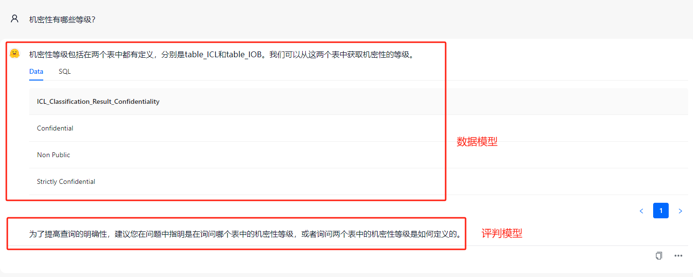
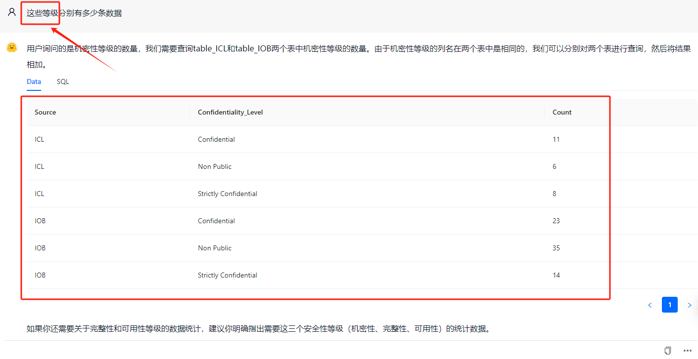
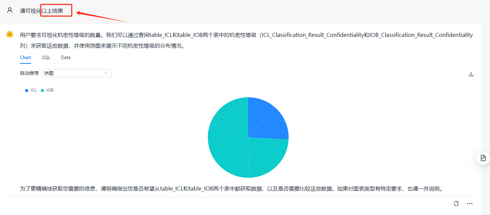
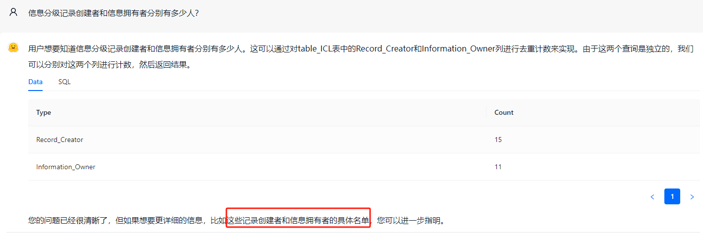
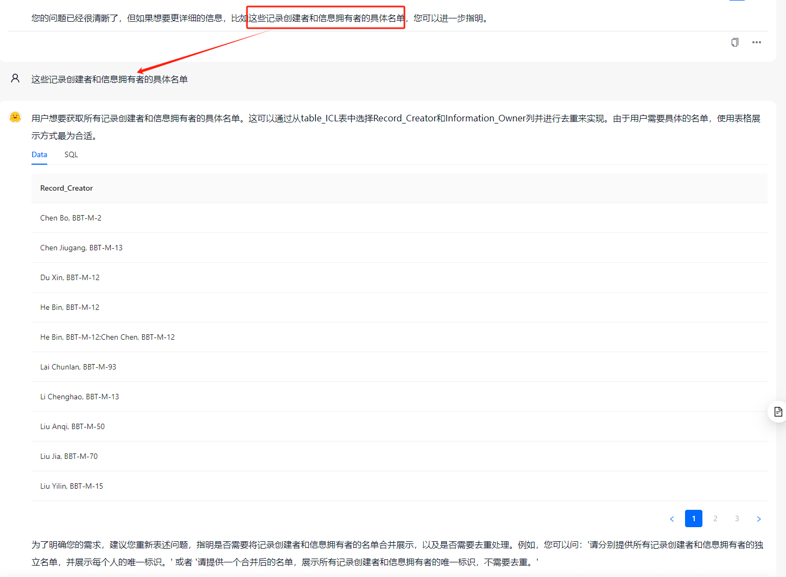

# DB-GPT

## Usage

- **Chat Data**

   - 基于Chroma向量库执行相关表信息的召回（top5）；
   - 融合历史对话信息（latest 5）；
   - 基于deepseek-chat生成sql；
   - 基于GLM-4-0520生成query suggestion；
   

## Features

针对Chat Data，在原有DB-GPT功能上新增：

- **评判模型回复**：在获取到数据模型的输出后，使用评判模型生成query的修改建议。
- **图文流式输出**：实时流式输出数据模型的文字和图表，以及评判模型的文字回复。


## Models

目前设计到两类模型，都以API的形式进行调用。

- 数据模型：deepseek-chat
- 评判模型：glm-4

## Examples
- 样例1：多轮对话效果




- 样例2：评判模型效果




## TODO

- [ ] SchemaLinking
   - [x] 表信息召回
   - [ ] 标签、指标召回
- [ ] LableLinking


## Install

具体可参考：[**DB-GPT源码部署**](https://www.yuque.com/eosphoros/dbgpt-docs/urh3fcx8tu0s9xmb)

1. 下载源码

   ```shell
   $ git clone http://172.30.81.214/xiqiu/DB_GPT.git
   ```

2. 创建虚拟环境

   ```shell
   python >= 3.10
   $ conda create -n dbgpt_env python=3.10
   $ conda activate dbgpt_env

   # it will take some minutes
   $ pip install -e ".[default]"
   ```

   ```shell
   $ cp .env.template  .env
   ```

3. 在.env文件中配置chat模型代理

   ```shell
   # deepseek
   LLM_MODEL=deepseek_proxyllm
   PROXY_API_KEY={your-openai-sk}
   DEEPSEEK_API_BASE=https://api.deepseek.com/v1

   # zhipu
   # LLM_MODEL=zhipu_proxyllm
   # PROXY_SERVER_URL=https://open.bigmodel.cn/api/paas/v4/
   # ZHIPU_MODEL_VERSION=GLM-4-0520
   # ZHIPU_PROXY_API_KEY={your-openai-sk}
   ```

4. embedding模型需要本地启动，在项目models文件夹下添加bge-base-zh模型文件

5. 数据库db文件可放置在datas文件夹下，在项目启动后，在“数据库”中配置即可。

6. 启动服务

   ```shell
   $ python dbgpt/app/dbgpt_server.py
   ```

7. web端打开页面：[127.0.0.1:5670](127.0.0.1:5670)


